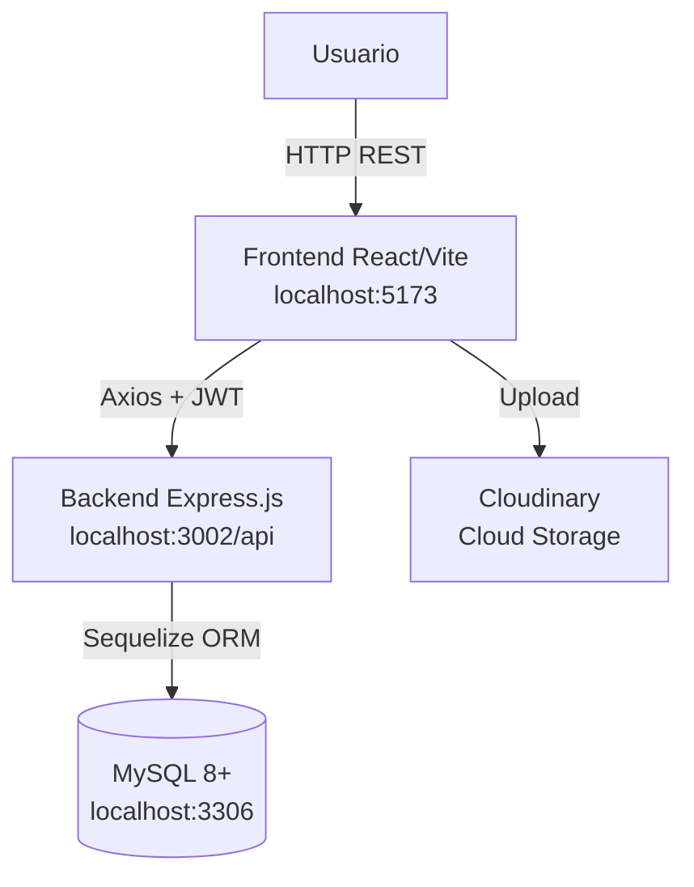

# Arquitectura de la aplicación

DIKË es una aplicación web de **cliente-servidor** con una clara separación entre frontend y backend que se comunican mediante una **API REST**.

## Diagrama general

## Separación frontend / backend

- **Frontend:** Aplicación React con Vite, servida en el puerto `5173`. Maneja toda la lógica de presentación, autenticación en cliente y comunicación con la API.
- **Backend:** Servidor Express.js en el puerto `3002`. Gestiona toda la lógica de negocio, validación, autenticación JWT y acceso a datos.
- **Comunicación:** REST API mediante HTTP con tokens JWT en cabecera `Authorization: Bearer <token>`.

## Lenguajes de programación

| Parte         | Lenguaje / Framework             | Versión |
|---------------|----------------------------------|---------|
| Frontend      | JavaScript (React 19.2.0)        | ES6+    |
| Backend       | JavaScript (Node.js + Express)   | 18+     |
| Base de datos | SQL (MySQL)                      | 8+      |

## Versiones mínimas requeridas

| Tecnología | Versión mínima |
|------------|----------------|
| Node.js    | 18.0.0         |
| npm        | 9.0.0          |
| MySQL      | 8.0            |

## Puertos utilizados

| Servicio | Puerto | URL                          |
|----------|--------|------------------------------|
| Frontend | 5173   | http://localhost:5173        |
| Backend  | 3002   | http://localhost:3002        |
| MySQL    | 3306   | localhost:3306               |
| API Base |        | http://localhost:3002/api    |
